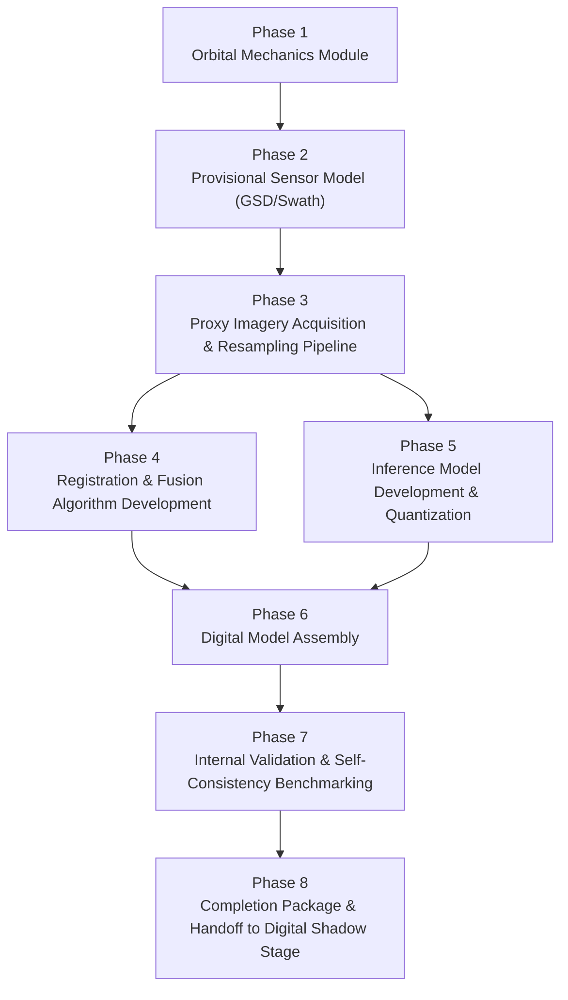

# Digital Model — Implementation Plan (No Hardware, No Ground Baseline Required)

This plan produces a complete, working **Digital Model** — the fully self-contained simulation stage that can be built and finished with zero dependency on procured hardware, sensor bring-up, or ground-captured baseline metrics. Every phase below uses only: orbital-mechanics tooling, public/proxy satellite imagery, and software you can develop and test entirely on a laptop.

**Why "Digital Model" and not "Digital Twin" — read this before starting.** Per the standard taxonomy (Kritzinger et al., 2018), a *Digital Model* has no automatic data connection to a physical asset; a *Digital Shadow* has an automatic **one-way** connection (physical → digital); a full *Digital Twin* requires an automatic **two-way** connection. Since no payload hardware exists yet, there is nothing to connect to — what this plan builds is, precisely, the Digital Model stage. It becomes a Digital Shadow once real ground-test data starts feeding into it (covered by `Digital_Twin_Prerequisite_Benchmarks.md` and `Digital_Twin_Implementation_Plan.md`, both of which pick up exactly where this plan leaves off). It only becomes a true Digital Twin if a flown payload someday streams telemetry back into it automatically. This plan is scoped honestly to what it actually is.

**What this plan deliberately excludes, and why:**
- No physical sensor bring-up, no I2C/SPI/UART work, no procured camera/thermal/IMU/GPS hardware.
- No ground-captured RGB/thermal frame pairs, no on-device power/memory/latency measurement.
- No "ground-vs-orbit accuracy delta" — that metric requires a real ground baseline that doesn't exist yet. This plan produces the **orbit-side half** only, fully validated on its own terms, ready to be compared against ground data the moment it exists.

**Source reference:** `Architecture_and_Novelty.md` §6 (Digital Twin Architecture), read here as the specification for the Digital Model's target end-state.

---

## Plan-Wide Principles

1. **Every hardware-shaped input becomes an explicit, labeled placeholder.** Where the architecture calls for a real camera's datasheet values, this plan uses a *candidate* camera's published spec instead, tagged `PROVISIONAL` everywhere it's used — never silently treated as final.
2. **All algorithm development uses stand-in data, clearly labeled as such.** Registration, fusion, and inference are all developed and tuned against proxy satellite imagery (and, where useful, public RGB+thermal datasets) — never presented as if it were the payload's own sensor data.
3. **Internal consistency replaces ground comparison as the validation bar.** Since there's no ground baseline yet, "does this work?" is answered by self-consistency checks (does registration converge, does the model learn, are results stable across reasonable parameter ranges) rather than a ground-vs-orbit delta.
4. **Nothing here is thrown away once hardware arrives.** Every module, dataset, and trained model produced by this plan is built to be reused, not replaced, when the project moves into the Digital Shadow stage — only the *comparison target* changes, not the code.

---

## Phase Overview

Phases 4 and 5 can run in parallel once Phase 3's dataset exists — one team can develop registration/fusion while another trains the inference model, since neither depends on the other's output until Phase 6.

---

## Phase 1 — Orbital Mechanics Module

### Objective
Build and cross-validate the orbital period, sun-synchronous inclination, and ground-track/pass-schedule logic — the foundation layer, and the one piece of this plan that is 100% hardware-independent by nature (it's pure physics, not sensor data).

### Tasks
1. Implement orbital period: $T = 2\pi\sqrt{a^3/\mu}$, $\mu = 398{,}600\text{ km}^3/\text{s}^2$, $a = R_e + \text{altitude}$ (§6.2).
2. Implement the sun-synchronous inclination solver from the J2 precession equation: $\frac{d\Omega}{dt} = -\frac{3}{2} n J_2 \left(\frac{R_e}{a}\right)^2 \frac{\cos i}{(1-e^2)^2}$, solved for inclination $i$ at a chosen altitude (§6.2).
3. Cross-validate both by hand calculation, GMAT, and a Python library (`skyfield` or `poliastro`) — require agreement within 0.5% (period) and a fraction of a degree (inclination) across all three methods before proceeding.
4. Generate a ground track over a chosen mission altitude and a 24-hour propagation window.
5. Implement a pass-over-target-region query: given a ground track and a target lat/lon region, return timestamps of overpasses.

### Tools
GMAT, `skyfield`/`poliastro`, NumPy, a calculator/spreadsheet for the hand derivation.

### Deliverable (end of Phase 1)
A tested `orbital_model` module (`orbital_period()`, `sun_sync_inclination()`, `ground_track()`, `passes_over_region()`) with a written three-way cross-validation record showing agreement across hand calculation, GMAT, and the Python library.

---

## Phase 2 — Provisional Sensor Model (GSD / Swath)

### Objective
Compute what ground resolution the payload's camera *would* achieve from orbit, using a candidate camera's published specifications — without requiring the physical unit to be procured or in hand.

### Tasks
1. Select a candidate RGB camera (any realistic module under consideration) and pull its pixel size and focal length from its **published datasheet** — a real, findable spec sheet, not an invented number.
2. Compute GSD and swath: $\text{GSD} = \dfrac{\text{pixel\_size}\times\text{altitude}}{\text{focal\_length}}$, $\text{Swath} = \text{GSD}\times\text{pixels\_across\_track}$ (§6.2), using Phase 1's chosen altitude.
3. Tag every downstream use of this GSD/swath value with a `PROVISIONAL — pending final camera procurement` label, both in code (a constant/config flag) and in documentation.
4. Make a preliminary go/no-go judgment on whether this candidate camera's GSD is adequate for the intended classification task (e.g., large-area thermal anomaly vs. cloud detection) — document the reasoning, understanding this judgment will be re-confirmed once the real camera is procured.

### Tools
Candidate camera datasheet(s), a calculator/spreadsheet, Phase 1's `orbital_model` module.

### Deliverable (end of Phase 2)
A `sensor_model` module (`gsd()`, `swath()`, `footprint()`) parameterized so any camera's specs can be swapped in later, populated with the current candidate camera's provisional values, and a documented preliminary go/no-go judgment with its reasoning and its "provisional" caveat clearly stated.

---

## Phase 3 — Proxy Imagery Acquisition & Resampling Pipeline

### Objective
Build the complete, repeatable pipeline that turns a pass schedule into a labeled dataset of orbit-representative image pairs, using only public satellite data — no payload hardware involved anywhere in this phase.

### Tasks
1. Register (if not already done) for Copernicus Open Access Hub (Sentinel-2) and USGS EarthExplorer (Landsat) accounts.
2. Using Phase 1's pass schedule and Phase 2's provisional GSD/swath, download Sentinel-2 optical and Landsat thermal-band tiles covering the target region(s), across a range of scene conditions relevant to the intended classification task (varied cloud cover, varied thermal backgrounds).
3. Build a `rasterio`/GDAL script that crops each tile to a pass's footprint, reprojects as needed, and resamples to the provisional GSD from Phase 2.
4. Package each resampled pair (optical + thermal-band) with its pass metadata (timestamp, footprint, GSD) into a structured dataset directory with a manifest.
5. Apply labels to every sample for the chosen classification task (e.g., cloud/no-cloud from known Sentinel-2 cloud masks; thermal-anomaly/no-anomaly from known hotspots in the Landsat thermal band, or from a public thermal dataset supplementing this one — see Phase 4).
6. Quality-check a sample of the dataset: no blank/corrupted tiles, correct footprint alignment between the optical and thermal tile of each pair, resolution matching the Phase 2 GSD rather than the source imagery's native resolution.

### Tools
`rasterio`, GDAL, Copernicus/EarthExplorer accounts, a dataset manifest format (CSV/JSON).

### Deliverable (end of Phase 3)
A labeled, orbit-resampled proxy imagery dataset (target: 100+ samples) with a documented, re-runnable acquisition-and-resampling pipeline and a manifest tying every sample to its source pass and label.

---

## Phase 4 — Registration & Fusion Algorithm Development

### Objective
Develop and tune the cross-modal image registration and fusion algorithms entirely against stand-in data — proving the algorithms work as designed before any real payload sensor data exists to test them on.

### Tasks
1. Implement the registration pipeline: keypoint detection (ORB, or a thermal-adapted alternative) → feature matching → RANSAC homography estimation → warp (§5.1).
2. **Use Phase 3's proxy dataset as development/tuning data**, explicitly labeled as algorithm-development data, not a ground-truth flight-sensor benchmark. Since Sentinel-2 optical and Landsat thermal-band imagery are themselves two different modalities at different native resolutions, they present a genuinely useful (if imperfect) stand-in for the RGB/thermal registration problem.
3. **Optionally supplement with a public RGB+thermal dataset** (e.g., FLIR's ADAS thermal dataset, or any similarly available paired visible/thermal dataset) purely to get more diverse training/tuning signal for the registration and fusion code — again, explicitly labeled as supplementary development data, never conflated with the payload's own sensor characteristics.
4. Build the RMSE measurement harness now (manually annotate corresponding points on a subsample of the development dataset) and measure registration accuracy on this stand-in data, so the harness itself is proven working before real ground data exists to run it on.
5. Implement the fusion baseline: $F(x,y) = \alpha\cdot\text{RGB}(x,y) + (1-\alpha)\cdot\text{Thermal}_{\text{registered}}(x,y)$ (§5.2), and sweep α to characterize its effect using SSIM/PSNR on the stand-in data.
6. Document every finding as "measured on proxy/stand-in data" — carry this caveat into every result, consistent with the plan-wide labeling principle.

### Tools
OpenCV, scikit-image, Phase 3's dataset, an optional public thermal-RGB dataset, a point-annotation script.

### Deliverable (end of Phase 4)
Working registration and fusion implementations, an RMSE measurement harness proven functional on stand-in data with a recorded accuracy figure, an SSIM/PSNR-informed α recommendation, and a clear written caveat that all figures are proxy-data results pending re-measurement on real ground sensor data.

---

## Phase 5 — Inference Model Development & Quantization

### Objective
Train, evaluate, and quantize the on-board classification model entirely on proxy/stand-in labeled data — including a fully legitimate, hardware-independent measurement of the quantization accuracy drop.

### Tasks
1. Finalize the classification task definition (e.g., cloud/no-cloud, or thermal-anomaly/no-anomaly), matching whatever Phase 3's dataset was labeled for.
2. Design the MobileNet-style depthwise-separable CNN within the architecture's hard parameter ceiling (low hundreds-of-thousands to a few million parameters, §5.3).
3. Train the model on Phase 3's (and optionally Phase 4's supplementary) labeled dataset, using a genuinely held-out test split.
4. Evaluate float32 accuracy, confusion matrix, and per-class precision/recall on the held-out set.
5. Convert to `.tflite` and apply post-training int8 quantization; re-evaluate on the identical held-out set.
6. **Compute the quantization accuracy delta.** This step needs no physical hardware at all — both the float32 and int8 models can be run on a development machine's TFLite interpreter, so this is a fully legitimate, complete measurement at this stage, not a placeholder.
7. If the quantization drop is unacceptable, apply quantization-aware training as a fallback, per the architecture's own escalation path (§5.3).

### Tools
TensorFlow/Keras (or PyTorch), TensorFlow Lite Converter and quantization tools, Phase 3's dataset.

### Deliverable (end of Phase 5)
A trained float32 model and its quantized int8 counterpart, both evaluated on the identical held-out proxy-data test set, with a fully measured (not estimated) quantization accuracy delta and confusion matrices for both versions.

> **Note on what remains hardware-dependent:** on-device *inference latency* (how fast the model actually runs on a Pi Zero 2W or ESP32-S3) still requires physical hardware and is explicitly out of scope for this plan — accuracy and quantization delta are hardware-independent; latency is not.

---

## Phase 6 — Digital Model Assembly

### Objective
Wire Phases 1–5 together into one coherent, end-to-end simulation pipeline: orbit → footprint → proxy imagery → registration → fusion → inference → result. This is the point at which the Digital Model, as a single running system, actually comes into existence.

### Tasks
1. Build a single orchestration script/pipeline that: takes a target altitude and region (Phase 1), computes the pass schedule and footprints (Phase 2), pulls or references the corresponding resampled imagery (Phase 3), and runs it through registration (Phase 4) → fusion (Phase 4) → inference (Phase 5), producing a final classification result per simulated pass.
2. Ensure every stage is a clearly separated, independently callable function/module — this modularity is what will let the Digital Shadow stage later swap in real ground-sensor inputs without rewriting the registration/fusion/inference logic itself (the same code-reuse principle the architecture specifies for the eventual full digital twin, §10.4 — just applied one stage earlier, so it's already in place when hardware arrives).
3. Run the assembled pipeline end-to-end on the full Phase 3 dataset and confirm it completes without unhandled errors on every sample.
4. Write a single README describing how to run the full pipeline from a fresh checkout, including all the `PROVISIONAL` labels currently in effect (camera specs, orbital altitude choice, task definition) and exactly what needs to be swapped in once hardware exists.

### Tools
The Phase 1–5 modules, a lightweight orchestration script (plain Python is sufficient — no workflow framework needed at this scale).

### Deliverable (end of Phase 6)
A single, working, end-to-end Digital Model pipeline — orbit through classification result — that runs successfully on the full proxy dataset, with clean module boundaries and a README documenting every provisional assumption still in effect.

---

## Phase 7 — Internal Validation & Self-Consistency Benchmarking

### Objective
Since there is no ground baseline to compare against yet, validate the Digital Model on its own terms: is it internally consistent, stable, and behaving the way the underlying physics and algorithms predict it should?

### Tasks
1. **Registration self-consistency:** confirm RMSE (from Phase 4's harness) stays stable and reasonable across the full range of scene types in the Phase 3 dataset — flag any scene category where registration degrades sharply, using the same scene-stratification approach the architecture specifies for ground testing (§6.3), applied here to proxy data.
2. **Altitude sensitivity check:** re-run Phase 2's GSD calculation and Phase 3's resampling at two or three different candidate altitudes, and confirm the pipeline's classification accuracy responds in the expected direction (coarser GSD at higher altitude should not improve accuracy — if it does, something in the resampling logic is likely wrong).
3. **α sensitivity re-check:** confirm the fusion α value chosen in Phase 4 still produces the best (or near-best) inference accuracy across the full Phase 3 dataset, not just the tuning subsample it was originally chosen on.
4. **Provisional-camera sensitivity check:** re-run the full pipeline with one or two alternative candidate camera specs (different pixel size/focal length) to see how sensitive the final classification accuracy is to the still-unconfirmed camera choice — this tells you how much risk is riding on Phase 2's provisional value.
5. **Reproducibility check:** re-run the full Phase 6 pipeline a second time on the same inputs and confirm identical (or near-identical, accounting for any legitimate stochasticity like data augmentation) results — a basic but essential check that the simulation isn't silently non-deterministic in a way that would undermine any result drawn from it later.

### Tools
The Phase 6 assembled pipeline, matplotlib for visualizing sensitivity sweeps.

### Deliverable (end of Phase 7)
A written internal-validation report covering: registration stability across scene types, the altitude-sensitivity sweep, the α re-check, the camera-choice sensitivity analysis, and a confirmed reproducibility result — establishing that the Digital Model behaves sensibly and consistently on its own terms, independent of any ground comparison.

---

## Phase 8 — Completion Package & Handoff to the Digital Shadow Stage

### Objective
Package the finished Digital Model for handoff — both to whoever presents this work externally, and to the future phase of the project where real ground-test data starts flowing in and the system graduates from Digital Model to Digital Shadow.

### Tasks
1. Write the final Digital Model report: orbital parameters used, the provisional sensor model and its go/no-go judgment, the proxy dataset and its composition, registration/fusion/inference results (all explicitly labeled as proxy-data results), and the Phase 7 self-consistency findings.
2. Write an explicit **"What Changes When Hardware Arrives"** section, listing every provisional input and exactly what replaces it:
   - Provisional camera datasheet values → real procured camera's datasheet values (re-run Phase 2).
   - Proxy-data registration/fusion tuning → re-validated against real ground-captured RGB+thermal frame pairs (this is `Digital_Twin_Prerequisite_Benchmarks.md` Teams 4–5).
   - Proxy-data-trained inference model → re-evaluated (and likely fine-tuned or retrained) on real ground-captured labeled data (`Digital_Twin_Prerequisite_Benchmarks.md` Team 6).
   - No ground-vs-orbit delta yet computed → becomes computable the moment real ground baselines exist, using this plan's Phase 6 pipeline unchanged as the "orbit" side of that comparison (this is where `Digital_Twin_Implementation_Plan.md` Day 5–6 picks up).
3. State the terminology explicitly, one final time, in the report: *"This is a Digital Model — a self-contained simulation with no automatic data connection to physical hardware, since none currently exists. It will become a Digital Shadow once ground-test data feeds into it, and would only become a full Digital Twin if a flown payload streamed telemetry back into it automatically — which is out of scope for this project."*
4. Tag/archive the exact code, dataset, and trained model versions used to produce the final report, so the eventual Digital Shadow work has a precise, reproducible starting point rather than an ambiguous "whatever the code looked like at the time."

### Tools
Version control (git tag or release), whatever documentation format the team standardizes on.

### Deliverable (end of Phase 8 — final deliverable of this plan)
A complete, versioned Digital Model package: the working end-to-end pipeline (Phase 6), its internal validation report (Phase 7), a final written report with every provisional assumption disclosed and an explicit "what changes when hardware arrives" roadmap, and correct, precise terminology throughout — ready to be handed directly into the Digital Shadow work already specified in `Digital_Twin_Prerequisite_Benchmarks.md` and `Digital_Twin_Implementation_Plan.md`.

---

## Master Checklist

- [ ] **Phase 1:** Orbital model built and three-way cross-validated.
- [ ] **Phase 2:** Provisional sensor model (GSD/swath) computed and tagged; preliminary go/no-go judgment documented.
- [ ] **Phase 3:** Labeled, orbit-resampled proxy imagery dataset built (100+ samples) with a repeatable pipeline.
- [ ] **Phase 4:** Registration and fusion implemented and tuned on stand-in data, with a proven RMSE/SSIM harness.
- [ ] **Phase 5:** Float32 and quantized inference models trained and evaluated on proxy data, with a real quantization delta measured.
- [ ] **Phase 6:** Full end-to-end Digital Model pipeline assembled and running cleanly on the whole dataset.
- [ ] **Phase 7:** Self-consistency validation complete (scene stability, altitude sensitivity, α re-check, camera sensitivity, reproducibility).
- [ ] **Phase 8:** Final report and versioned handoff package delivered, with explicit "what changes when hardware arrives" documentation and correct Digital Model terminology throughout.

---

*Derived from `Architecture_and_Novelty.md` §6, scoped explicitly to exclude any dependency on procured hardware or ground-captured baseline data, per the Digital Model / Digital Shadow / Digital Twin distinction (Kritzinger et al., 2018) discussed alongside this plan. Phase breakdown and hardware-independence scoping are original synthesis produced for this document. This plan hands off directly into `Digital_Twin_Prerequisite_Benchmarks.md` and `Digital_Twin_Implementation_Plan.md` once real hardware and ground-test data become available.*
