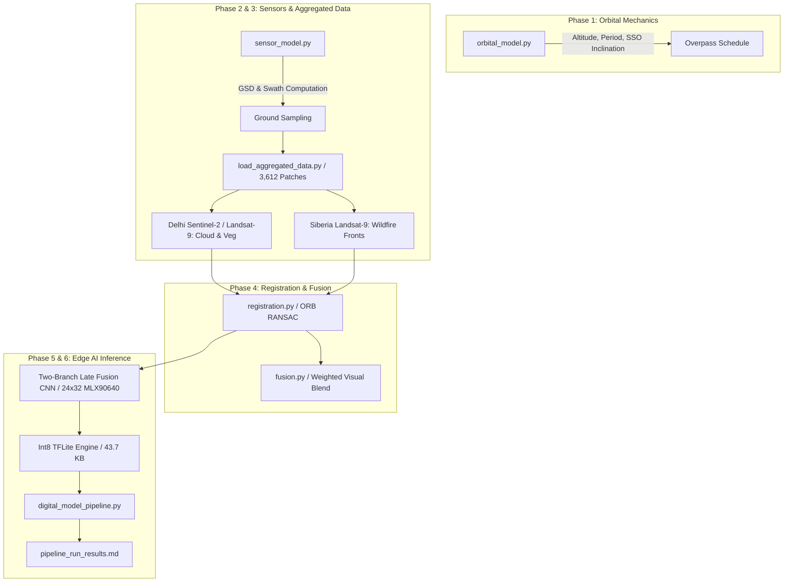

# EdgeAI Satellite Digital Model (Release v1.1)

[](file:///pipeline_run_results.md)
[-blue)](file:///quantization_delta.md)
[](#)

A physics-informed, modular digital simulation and edge AI inference framework for a dual-payload (Optical RGB + Thermal Infrared MLX90640) Earth observation CubeSat mission.

---

## 1. Digital Model Terminology & Mission Context

In strict accordance with the project's [Terminology Statement](file:///terminology_statement.md) and Systems Engineering standards:

- **Digital Model (This Repository)**: A purely computational representation of the satellite's orbital dynamics, sensor optical geometry, cross-modal image processing, and neural network inference, running on simulated and proxy data before physical flight hardware integration.
- **Digital Shadow (Next Phase)**: One-way telemetry streaming from physical payload hardware (embedded target dev-boards and optical benches) to update and calibrate model parameters.
- **Digital Twin (Flight Phase)**: Bidirectional closed-loop coupling between the operational satellite in orbit and the ground control digital twin.

---

## 2. Quick Start Guide

### Prerequisites
- Python 3.10+
- GDAL / Rasterio runtime libraries
- TensorFlow 2.16+ / TFLite runtime

### Installation
```bash
# Clone the repository
git clone https://github.com/SohamB-42/edgeai-digital-model.git
cd edgeai-digital-model

# Install dependencies
pip install numpy rasterio opencv-python scikit-image tensorflow scikit-learn
```

### Running the End-to-End Multi-Task Pipeline
Execute the master orchestrator to run orbital mechanics, sensor calculations, registration, and edge inference across all 3,612 samples:

```bash
# Run all tasks (Cloud, Vegetation, Wildfire)
python digital_model_pipeline.py --altitude 500 --task all
```

### Running the Interactive Visual Demonstrator
Launch the live satellite dashboard showcasing real-time optical RGB, thermal heatmap, and on-device Edge AI decision-making:

```bash
# Scene 1: Delhi Pass (Cloud & Vegetation Filtering)
python demo_visualizer.py --scene delhi --sample 0

# Scene 2: Siberia Pass (Wildfire Thermal Anomaly Detection)
python demo_visualizer.py --scene siberia --sample 25

# Automated Live Slideshow Mode
python demo_visualizer.py --scene siberia --slideshow
```

---

## 3. End-to-End System Architecture



---

## 4. Multi-Task Benchmark Summary

| Mission Task | Dataset | Samples (Pos / Total) | Accuracy | Precision | Recall | F1-Score | Int8 Latency | Int8 Size |
|:-------------|:--------|:---------------------:|:--------:|:---------:|:------:|:--------:|:------------:|:---------:|
| **Cloud Detection** | Sentinel-2 Delhi | 735 / 1,764 | **98.13%** | 0.9705 | 0.9850 | **0.9777** | **0.15 ms** | **43.7 KB** |
| **Vegetation Mapping** | Sentinel-2 Delhi | 462 / 933 | **81.67%** | 0.7299 | **1.0000** | **0.8438** | **0.27 ms** | **43.7 KB** |
| **Wildfire Detection** | Landsat-9 Siberia | 134 / 1,848 | **95.24%** | 0.6643 | 0.6940 | **0.6788** | **0.20 ms** | **43.7 KB** |

*All spatial 4-fold cross-validations enforce zero geographic data leakage between training and testing folds.*

---

## 5. Subsystem Breakdown

| Subsystem | Module | Primary Purpose | Key Output / Metric |
|:----------|:-------|:----------------|:--------------------|
| **Orbital Mechanics** | [`orbital_model.py`](file:///orbital_model.py) | Closed-form circular orbit propagation, Keplerian period, and J2 SSO inclination | Period: `94.47 min`, SSO Inc: `97.39°` |
| **Sensor Geometry** | [`sensor_model.py`](file:///sensor_model.py) | GSD & ground swath calculation for Sony IMX477 and Melexis MLX90640 | Optical GSD: `15.5 m`, Thermal GSD: `315.8 m` |
| **Data Loader** | [`load_aggregated_data.py`](file:///load_aggregated_data.py) | Standardized multi-scene loader with fold-isolated thermal normalization | 3,612 multi-spectral patches |
| **Registration** | [`registration.py`](file:///registration.py) | ORB keypoint detection and RANSAC homography bounding crop | Alignment homography matrix |
| **Visual Fusion** | [`fusion.py`](file:///fusion.py) | Generates weighted pixel blend frames for logging & telemetry | Fused visual product |
| **CNN Architecture** | [`model_architecture.py`](file:///model_architecture.py) | Two-branch late-fusion CNN (`19,090` parameters, `(24, 32, 1)` thermal shape) | Budget $< 2\text{M}$ params, `3.95M` MACs |
| **Training Pipeline** | [`train_aggregated_pipeline.py`](file:///train_aggregated_pipeline.py) | Multi-task spatial 4-fold CV training across Cloud, Vegetation, and Wildfire | Models exported to `models/` |
| **Quantization** | [`quantize_model.py`](file:///quantize_model.py), [`quantization_delta.py`](file:///quantization_delta.py) | Full integer post-training Int8 TFLite conversion & delta analysis | `43.7 KB` flatbuffer, delta $< 0.22\text{ pp}$ |
| **Master Orchestrator** | [`digital_model_pipeline.py`](file:///digital_model_pipeline.py) | Unified end-to-end execution across all 3,612 samples | `3,612/3,612` samples with 0 errors |
| **Visual Demonstrator** | [`demo_visualizer.py`](file:///demo_visualizer.py) | Live interactive mission simulator (Delhi & Siberia passes) | Interactive UI & PNG exports |

---

## 6. What Changes When Hardware Arrives (Digital Shadow)

When physical hardware is received, follow [`hardware_handoff.md`](file:///hardware_handoff.md):

1. **Update Camera Parameters**: Modify [`sensor_specs.json`](file:///sensor_specs.json) with bench-calibrated focal lengths and detector pitch.
2. **Re-run GSD & Swath Calculations**: Execute `sensor_model.py` to update mission planning tables.
3. **Calibrate Registration Matrices**: Apply physical lens distortion coefficients ($k_1, k_2$) in `registration.py`.
4. **Deploy Int8 Model to Embedded MCU/NPU**: Flash [`models/model_cloud_int8.tflite`](file:///models/model_cloud_int8.tflite) and [`models/model_fire_int8.tflite`](file:///models/model_fire_int8.tflite) (`43.7 KB`) to target edge hardware (e.g., ESP32-S3 / STM32N6 / Coral Edge TPU).
5. **Clear Provisional Flags**: Toggle `PROVISIONAL = False` in `sensor_model.py`.

---

*For detailed execution logs, see [`pipeline_run_results.md`](file:///pipeline_run_results.md) and [`training_log.md`](file:///training_log.md).*
