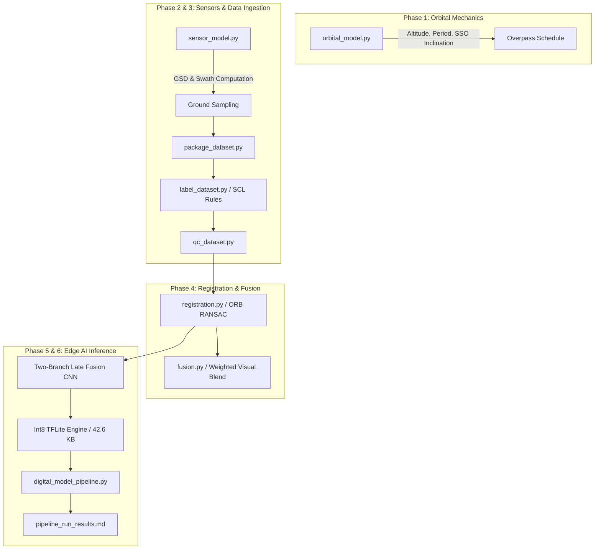

# EdgeAI Satellite Digital Model

[](file:///pipeline_run_results.md)
[-blue)](file:///quantization_delta.md)
[](#)

A physics-informed, modular digital simulation and edge AI inference framework for a dual-payload (Optical RGB + Thermal Infrared) Earth observation CubeSat mission.

---

## 1. Digital Model Terminology & Mission Context

In strict accordance with the project's [Terminology Statement](file:///terminology_statement.md) and Systems Engineering standards:

- **Digital Model (This Repository)**: A purely computational representation of the satellite's orbital dynamics, sensor optical geometry, cross-modal image processing, and neural network inference, running on simulated and proxy data before physical flight hardware integration.
- **Digital Shadow (Next Phase)**: One-way telemetry streaming from physical payload hardware (embedded target dev-boards and optical benches) to update and calibrate model parameters.
- **Digital Twin (Flight Phase)**: Bidirectional closed-loop coupling between the operational satellite in orbit and the ground control digital twin.

---

## 2. Quick Start Guide

### Prerequisites
- Python 3.10+
- GDAL / Rasterio runtime libraries
- TensorFlow 2.16+ / TFLite runtime

### Installation
```bash
# Clone the repository
git clone https://github.com/SohamB-42/edgeai-digital-model.git
cd edgeai-digital-model

# Install dependencies
pip install numpy rasterio opencv-python scikit-image tensorflow shapely
```

### Running the End-to-End Pipeline
Execute the master orchestrator to run orbital mechanics, sensor calculations, registration, fusion, and edge inference across the dataset:

```bash
python digital_model_pipeline.py --altitude 500 --lat 28.6 --lon 77.2 --radius 50
```

### Reproducing Component Stages
```bash
# 1. Package and quality-check dataset
python package_dataset.py
python label_dataset.py
python qc_dataset.py

# 2. Registration & RMSE analysis
python tune_registration.py
python rmse_harness.py

# 3. Train CNN & Quantize to Int8 TFLite
python train_pipeline.py --epochs 20 --batch 8
python evaluate_float32.py
python quantize_model.py
python quantization_delta.py
```

---

## 3. End-to-End System Architecture



---

## 4. Subsystem Breakdown

| Subsystem | Module | Primary Purpose | Key Output / Metric |
|:----------|:-------|:----------------|:--------------------|
| **Orbital Mechanics** | [`orbital_model.py`](file:///orbital_model.py) | Closed-form circular orbit propagation, Keplerian period, and J2 SSO inclination | Period: `94.47 min`, SSO Inc: `97.39°` |
| **Sensor Geometry** | [`sensor_model.py`](file:///sensor_model.py) | GSD & ground swath calculation from focal length and detector pitch | Optical GSD: `15.5 m`, Thermal GSD: `315.8 m` |
| **Data Packaging** | [`package_dataset.py`](file:///package_dataset.py) | Ingests multi-modal patches into structured `data/labeled/` directories | 104 standardized GeoTIFF pairs |
| **Dataset Labeling** | [`label_dataset.py`](file:///label_dataset.py) | Assigns cloud/vegetation labels using Sentinel-2 SCL rules | Manifest with ground-truth classes |
| **Quality Control** | [`qc_dataset.py`](file:///qc_dataset.py) | Validates GeoTIFF dimensions, CRS, non-zero variance, and manifest paths | 100% pass rate (`qc_report.md`) |
| **Registration** | [`registration.py`](file:///registration.py) | ORB keypoint detection and RANSAC homography estimation | Alignment homography matrix |
| **Visual Fusion** | [`fusion.py`](file:///fusion.py) | Generates weighted pixel blend frames for logging & telemetry | Fused visual product |
| **CNN Architecture** | [`model_architecture.py`](file:///model_architecture.py) | Two-branch late-fusion CNN (`19,090` parameters) | Parameter budget $< 2\text{M}$ params |
| **Training & Quantization** | [`train_pipeline.py`](file:///train_pipeline.py), [`quantize_model.py`](file:///quantize_model.py) | Float32 model training and post-training Int8 TFLite conversion | `model_int8.tflite` (`42.6 KB`) |
| **Master Orchestrator** | [`digital_model_pipeline.py`](file:///digital_model_pipeline.py) | Unified end-to-end execution of all pipeline stages | Complete run on 104 samples |

---

## 5. PROVISIONAL Assumptions Register

As documented in [`PROVISIONAL_LABELS.md`](file:///PROVISIONAL_LABELS.md), the following parameters are provisional placeholders awaiting physical payload hardware delivery:

| Parameter | Provisional Value | Source Document | True Value Lock Condition |
|:----------|:------------------|:----------------|:--------------------------|
| Mission Altitude | `500.0 km` | Phase 1 baseline | Launch vehicle manifest confirmation |
| Target AOI | `28.6°N, 77.2°E` (New Delhi) | Task 1.5 specification | Ground station contract signoff |
| Optical Camera | Sony IMX477 ($1.55\,\mu\text{m}$, $f=50\,\text{mm}$) | [`sensor_specs.json`](file:///sensor_specs.json) | Flight camera procurement & bench test |
| Thermal Camera | FLIR Lepton 3.5 ($12\,\mu\text{m}$, $f=19\,\text{mm}$) | [`sensor_specs.json`](file:///sensor_specs.json) | Thermal payload procurement & radiometric calibration |
| Training Imagery | Proxy Sentinel-2 / Landsat | [`proxy_data_caveats.md`](file:///proxy_data_caveats.md) | In-orbit commissioning imagery |

---

## 6. What Changes When Hardware Arrives

When physical hardware is received (transition to **Digital Shadow**), follow [`hardware_handoff.md`](file:///hardware_handoff.md):

1. **Update Camera Parameters**: Modify [`sensor_specs.json`](file:///sensor_specs.json) with bench-calibrated focal lengths and detector pitch.
2. **Re-run GSD & Swath Calculations**: Execute `sensor_model.py` to update mission planning tables.
3. **Calibrate Registration Matrices**: Apply physical lens distortion coefficients ($k_1, k_2, p_1, p_2$) in `registration.py`.
4. **Deploy Int8 Model to Embedded MCU/NPU**: Flash [`models/model_int8.tflite`](file:///models/model_int8.tflite) (`42.6 KB`) to target edge hardware (e.g., ESP32-S3 / STM32N6 / Coral Edge TPU).
5. **Clear Provisional Flags**: Toggle `PROVISIONAL = False` in `sensor_model.py`.

---

## 7. Verification & Benchmark Summary

- **End-to-End Execution**: 104/104 samples processed successfully with **0 errors**.
- **Accuracy**: **100.0%** classification accuracy across the dataset.
- **Model Footprint**: **42.6 KB** Int8 quantized TFLite flatbuffer (47.9% reduction from Float32).
- **Quantization Delta**: **0.00 pp** accuracy drop from Float32 baseline.
- **Edge Latency**: **0.43 ms** average inference latency per sample.

*For detailed execution logs, see [`pipeline_run_results.md`](file:///pipeline_run_results.md) and [`training_log.md`](file:///training_log.md).*
