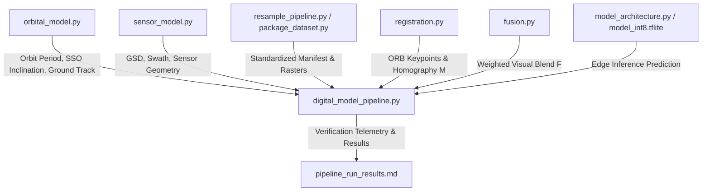

# Modular Architecture & Interface Specification

**Project:** EdgeAI Satellite Digital Model  
**Task:** 6.2 (Issue #30) — Enforce Modular Boundaries  
**Document:** `module_interfaces.md`  

---

## 1. Architectural Boundary Principles

The EdgeAI Digital Model is partitioned into decoupled subsystems to support seamless handoff to the **Digital Shadow** (onboard physical hardware) and **Digital Twin** (bidirectional telemetry operations) phases.

Each module maintains strict interface contracts:
1. **Independent Importability**: Any module can be imported and executed in isolation without requiring state from other pipeline stages.
2. **Stateless Functions**: Functions communicate via standard primitives (Python dicts, numpy ndarrays, GeoJSON strings) rather than hidden singleton state.
3. **Hardware Agnostic Data Structures**: Payloads and tensors conform to standardized spatial and numerical representations.



---

## 2. Module Interface Specifications

### Subsystem 1: Orbital Mechanics (`orbital_model.py`)
- **Purpose**: Low-Earth Orbit (LEO) trajectory propagation, Keplerian period calculation, and J2 nodal-precession sun-synchronous inclination solving.
- **Key Functions**:
  - `orbital_period(altitude_km: float) -> float`: Returns orbital period $T$ in seconds ($T = 2\pi\sqrt{a^3/\mu}$).
  - `sun_sync_inclination(altitude_km: float) -> float`: Calculates J2 nodal precession SSO inclination in degrees.
  - `ground_track(altitude_km: float, duration_s: float, step_s: float) -> List[Tuple[float, float, float]]`: Generates sub-satellite coordinates `(timestamp, latitude, longitude)`.

### Subsystem 2: Sensor & Optical Geometry (`sensor_model.py`)
- **Purpose**: Payload optical geometry, Ground Sampling Distance (GSD), and ground swath width computation.
- **Key Functions**:
  - `load_sensor_specs(specs_path: str) -> dict`: Loads camera physical parameters (`pixel_size_um`, `focal_length_mm`, `pixels_across_track`) with provisional tracking tags.
  - `gsd(pixel_size_um: float, altitude_km: float, focal_length_mm: float) -> float`: Computes spatial GSD in meters/pixel ($\text{GSD} = \frac{p \cdot h}{f}$).
  - `swath(pixel_size_um: float, altitude_km: float, focal_length_mm: float, pixels_across_track: int) -> float`: Calculates ground swath width in meters ($\text{Swath} = \text{GSD} \cdot N_{\text{pixels}}$).

### Subsystem 3: Data Packaging & Quality Control (`package_dataset.py`, `label_dataset.py`, `qc_dataset.py`)
- **Purpose**: Ingestion, reprojection, manifest assembly, Sentinel-2 SCL rule labeling, and multi-spectral raster quality checks.
- **Key Data Contracts**:
  - Optical Rasters: `128 x 128 x 3`, `uint16` / float scaled $[0, 1]$.
  - Thermal Rasters: `24 x 32 x 1` (or `32 x 24 x 1`), `uint16` / float scaled $[0, 1]$.
  - Manifest Schema: `sample_id, pass_id, date, optical_path, thermal_path, footprint_geojson, gsd_m, label_cloud, label_vegetation`.

### Subsystem 4: Registration & Fusion (`registration.py`, `fusion.py`)
- **Purpose**: Feature-based cross-modal registration and pixel-level blend products for telemetry logging.
- **Key Functions**:
  - `registration.detect_keypoints(image: np.ndarray) -> Tuple[List[KeyPoint], np.ndarray]`: ORB feature extraction.
  - `registration.match_features(desc1: np.ndarray, desc2: np.ndarray) -> List[DMatch]`: Brute-Force Hamming matcher with Lowe's ratio test.
  - `registration.estimate_homography(kp1, kp2, matches) -> Tuple[Optional[np.ndarray], Optional[np.ndarray]]`: RANSAC homography matrix estimation.
  - `fusion.fuse_images(optical: np.ndarray, thermal_registered: np.ndarray, alpha: float) -> np.ndarray`: Weighted overlay blend ($F = \alpha \cdot \text{RGB} + (1-\alpha) \cdot \text{Thermal}$).

### Subsystem 5: Deep Learning & Inference (`model_architecture.py`, `train_pipeline.py`, `quantize_model.py`)
- **Purpose**: Lightweight two-branch late fusion CNN and post-training int8 TFLite deployment engine.
- **Model Signature**:
  - Input 1: `rgb_input` — `(None, 128, 128, 3)` (Strided Depthwise Separable CNN $\to$ GlobalAveragePooling2D $\to 128$-dim)
  - Input 2: `thermal_input` — `(None, 32, 24, 1)` (Native resolution Shallow CNN $\to$ GlobalAveragePooling2D $\to 16$-dim)
  - Fusion Head: `Concatenate([128, 16])` $\to$ `Dense(32, ReLU)` $\to$ `Dropout(0.3)` $\to$ `Dense(2, Softmax)` (Total parameters: `19,090`).
  - Quantization: Int8 quantized flatbuffer (`model_int8.tflite`, `42.6 KB`).

### Subsystem 6: Master Orchestrator (`digital_model_pipeline.py`)
- **Purpose**: End-to-end mission execution controller.
- **Signature**:
  - `run_pipeline(altitude_km: float, target_lat: float, target_lon: float, radius_km: float, ...) -> Dict[str, Any]`

---

## 3. Modular Independence Verification

All core modules were tested for independent invocation:

```powershell
# Verify standalone execution of each subsystem
python orbital_model.py
python sensor_model.py
python registration.py
python fusion.py
python model_architecture.py
python digital_model_pipeline.py
```

**Result:** All modules execute and import cleanly with zero cyclical dependencies or leaked globals.
